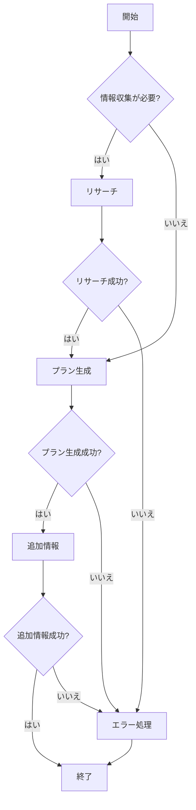

# 日本旅行プランナー 🏯

LangGraphとOpenAI APIを使用して、日本国内の旅行プランを提案するStreamlitアプリケーションです。

## 機能

- 現在地、目的地、予算、滞在期間などの条件に基づいた旅行プラン提案
- LangGraphを使用した段階的な旅行プランニングワークフロー
  - 情報収集ステップ
  - プラン生成ステップ
  - 追加情報提供ステップ
- Wikipedia、Google Search、Google Map等の各種APIを利用した情報収集
- OpenAI APIを使用した自然な旅行プランの生成
- 使いやすいStreamlitインターフェース

## セットアップ方法

### 前提条件

- Python 3.9以上
- 各種APIキー（OpenAI、SerpAPI）

### インストール

1. リポジトリをクローン

```bash
git clone https://github.com/your-username/trip-planner.git
cd trip-planner
```

2. 仮想環境を作成して有効化

```bash
python -m venv venv
source venv/bin/activate  # Windowsの場合: venv\Scripts\activate
```

3. 依存パッケージをインストール

```bash
pip install -r requirements.txt
```

4. 環境変数の設定

`.env.example`をコピーして`.env`ファイルを作成し、必要なAPIキーを設定します。

```bash
cp .env.example .env
```

`.env`ファイルを編集して、必要なAPIキーを追加します：

```
# OpenAI API
OPENAI_API_KEY=your_openai_api_key

# Google API
GOOGLE_API_KEY=your_google_api_key
GOOGLE_CSE_ID=your_google_cse_id

# SerpApi
SERPAPI_API_KEY=your_serpapi_api_key
```

### 実行方法

アプリケーションを起動するには、以下のコマンドを実行します：

```bash
streamlit run app.py
```

ブラウザで`http://localhost:8501`を開くと、アプリケーションにアクセスできます。

## 使い方

1. フォームに旅行条件（現在地、目的地、予算、滞在期間、目的）を入力します。
2. 「旅行プランを生成」ボタンをクリックします。
3. LangGraphワークフローが以下のステップで処理を行います：
   - 目的地に関する情報を収集
   - 情報に基づいて旅行プランを生成
   - 旅行に関する追加アドバイスを作成
4. 生成された旅行プランと追加情報が表示されます。

## ワークフローの仕組み

このアプリケーションはLangGraphを使った状態管理とワークフローを実装しています：



## 技術スタック

- **フロントエンド**: Streamlit
- **バックエンド**: LangGraph、LangChain、Python
- **API**: OpenAI API、Wikipedia API、SerpAPI

## 注意事項

- 一部の機能を使用するには、有効なAPIキーが必要です。
- 生成された旅行プランは参考情報です。実際の旅行計画を立てる際は、最新の情報を確認してください。
- APIリクエストには費用が発生する場合があります。使用方法と料金プランを確認してください。

## ライセンス

このプロジェクトはMITライセンスの下で公開されています。 